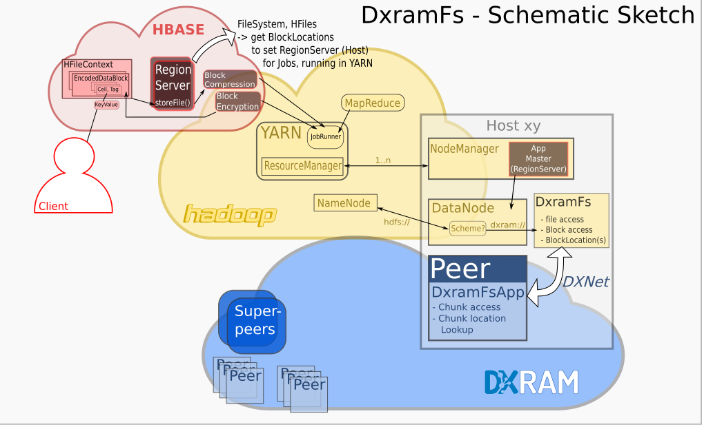

# DxramFS

This DXRAM connector lets you run [Apache Hadoop](http://hadoop.apache.org)
or [HBASE](https://hbase.apache.org/) jobs directly on data in [DXRAM](https://dxram.io/)
instead of HDFS.

**It is still in pre Alpha state!** and is still working in a `/tmp/myfs/` folder instead of dxram!


## Links

-   [Hadoop DXRAM Code on github](https://github.com/no-go/HadoopDxramFS)
-   [Hadoop DXRAM Website](https://no-go.github.io/HadoopDxramFS/)
-   [DX:RAM](https://dxram.io/)

## Helpful links ...

... to develop a hadoop-like FS and test it

-   [Spark&Hadoop Google Cloud Storage Connector](https://github.com/GoogleCloudPlatform/bigdata-interop/tree/master/gcs)
-   [Filesystem Compatibility with Apache Hadoop](https://wiki.apache.org/hadoop/HCFS)
-   [hadoop FS guide](https://hadoop.apache.org/docs/r2.4.1/hadoop-project-dist/hadoop-common/FileSystemShell.html)

## Build

    unzip HadoopDxramFS.zip
    cd HadoopDxramFS
    mvn clean
    mvn package

### ... with git

    git clone https://github.com/no-go/HadoopDxramFS
    cd HadoopDxramFS
    mvn clean
    mvn package

## Schematic Sketch



To reduce confusion, here are some simple keywords to communicate over
different project parts:

### DxramFs

-   the **hadoop part**
-   it is a **client**
-   it **requests** Filedata
-   it is a **connector** to a DXRAM Peer
-   it **uses DXNet** to connect to a DXRAM Peer/Application

### DxramFs-Peer

-   the **DXRAM part**
-   it is a **server**
-   it serves Filedata
-   it **handles DXNet Messages** with DXRAM
-   it is a **DXRAM Application** running on **a Peer**

### Node vs. Peer

Hadoop splits **processes** and lets calculate them **with blockdata on nodes** .

DXRAM splits **Memory requests** and get/set their data **as chunks on peers**.

## a DXNet/DXRAM Test

Start my Envorinment (and take a look into this bash file):

    . ./my-env.sh

Start the local relay peer to connect the local hadoop node with dxramfs:

    startDxramFsPeer

in future: this will be a DXRAM peer, which shares DXRAM as a
filesystem to a local hadoop node. The `DxramFs` Hadoop code will
be a client to that local server.

## Install

-   Take a look at the `my-env.sh` linux shell script.
-   Take a look at my notes about the `etc/hadoop/core-site.xml` file

# Notes (for me!)

use hadoop fs CLI to access `dxram://namenode:9000` from `core-site.xml`


## classes

-   ROOT is a FsNodeChunk
-   FsNodeChunk builds a tree with ID (dxram chunk id) and a 
    referenceId (parent FsNodeChunk ID)
-   FsNodeChunk stores data about a file or a folder
-   FsNodeChunk has an array of blockinfoIds (if it is full, extID refer
    to a FsNodeChunk with a new blockinfoIds array)
-   blockinfoIds are dxram chunk ids to BlockinfoChunks
-   BlockinfoChunk stores informations about a BlockChunk
-   every BlockinfoChunk refer with storageId (a dxram chunk id) to a BlockChunk
-   BlockChunk stores the bytes of a file

## todo

-   extract dxnet or dxram hostname/ip/port frome hadoop fs-scheme!

## other stuff

alpha works on /tmp/ folder and not in dxram!!!

ok:

    bin/hadoop fs -mkdir /user
    bin/hadoop fs -mkdir /user/tux
    bin/hadoop fs -ls /user
    cp example /tmp/user/tux/
    bin/hadoop fs -rm -f /user/tux
    bin/hadoop fs -rm -f /user/tux
    -> /user/tux not exists!
    bin/hadoop fs -put example.txt /user/ex.txt
    bin/hadoop fs -put example.* /user/
    bin/hadoop fs -rm example.txt /user/
    bin/hadoop fs -mv /user/example.txt abc.a
    -> /user/tux/abc.a
    bin/hadoop fs -mkdir -p /a/b/c
    bin/hadoop fs -cat /user/example.txt
    bin/hadoop fs -cp /user/example.txt /user/tux/ex.txt

working with hack (bad uri, path, localpath handling):

    bin/hadoop fs -ls /


File `hadoop-2.8.2-src/hadoop-dist/target/hadoop-2.8.2/etc/hadoop/core-site.xml`

```xml
<?xml version="1.0" encoding="UTF-8"?>
<?xml-stylesheet type="text/xsl" href="configuration.xsl"?>
<configuration>
    <property>
        <name>fs.dxram.impl</name>
        <value>de.hhu.bsinfo.dxramfs.connector.DxramFileSystem</value>
        <description>The FileSystem for dxram.</description>
    </property>
    <property>
        <name>fs.AbstractFileSystem.dxram.impl</name>
        <value>de.hhu.bsinfo.dxramfs.connector.DxramFs</value>
        <description>
            The AbstractFileSystem for dxram
        </description>
    </property>
    <property>
        <name>fs.defaultFS</name>
        <!-- value>file:///tmp/tee/</value -->
        <!-- value>hdfs://localhost:9000</value -->
        <value>dxram://localhost:9000</value>
    </property>
 
    <property>
        <name>dxram.file_blocksize</name>
        <!-- blocksize is a chunksize (dxram: jan 2018 max was 8MB) -->
        <value>8388608</value>
    </property>
    
    <property>
        <name>dxram.blockinfo_ids_each_fsnode</name>
        <value>100</value>
    </property>
    
    <property>
        <name>dxram.max_pathlength_chars</name>
        <value>500</value>
    </property>
    
    <property>
        <name>dxnet_local_id</name>
        <value>0</value>
    </property>
    <property>
        <name>dxnet_local_port</name>
        <value>65220</value>
    </property>
    <property>
        <name>dxnet_local_addr</name>
        <value>127.0.0.1</value>
    </property>

    <property>
        <name>dxnet_local_peer_id</name>
        <value>1</value>
    </property>
    <property>
        <name>dxnet_local_peer_port</name>
        <value>65221</value>
    </property>
    <property>
        <name>dxnet_local_peer_addr</name>
        <value>127.0.0.1</value>
    </property>

</configuration>
```

### Logging

If you use `org.slf4j` and ...

```java
LOG.info(Thread.currentThread().getStackTrace()[1].getMethodName()+"({})", p);
```

... in your code, you have to take a look to

    vim etc/hadoop/hadoop-env.sh

and set `export log4j_logger_org_apache_hadoop=INFO` to see your logs 
while using `bin/hadoop fs -<command> ...` !

**open issue:** using `LOG.debug()` and `export ...=DEBUG` did not work.

### hadoop yarn or mapReduce example

    cd /EXAMPLE/hadoop-2.8.2-src/hadoop-dist/target/hadoop-2.8.2/
    mkdir input
    cp etc/hadoop/*.xml input
    bin/hadoop jar share/hadoop/mapreduce/hadoop-mapreduce-examples-2.8.2.jar grep input output 'dxram[a-z.]+'

2018-02-23: this examples works on dxramfs (via /tmp/myfs/ folder, not dxram):

-   I got the right result
-   JobRunner (is a part of yarn, but you do not have to start-yarn.sh) runs on local fs. hdfs on single node do it local, too.

### MapReduce (MR) example RandomTextWriter

To get a big (300MB) text file, there is a MR example *RandomTextWriter*. You need a
config file `etc/hadoop/mapred-site.xml` to configure the 300222000 Byte output
insteat of 1099511627776 Bytes (default):

```xml
<?xml version="1.0"?>
<?xml-stylesheet type="text/xsl" href="configuration.xsl"?>
<configuration>
    <property>
      <name>mapreduce.randomtextwriter.minwordskey</name>
      <value>5</value>
    </property>
    <property>
      <name>mapreduce.randomtextwriter.maxwordskey</name>
      <value>10</value>
    </property>
    <property>
      <name>mapreduce.randomtextwriter.minwordsvalue</name>
      <value>20</value>
    </property>
    <property>
      <name>mapreduce.randomtextwriter.maxwordsvalue</name>
      <value>100</value>
    </property>
    <property>
      <name>mapreduce.randomtextwriter.totalbytes</name>
      <!-- value>1099511627776</value -->
      <value>300222000</value>
    </property>
</configuration>
```

If you are the user *tux* and have a `/user/tux/` home dir in hdfs or dxramfs you can
run this:

    bin/hadoop jar share/hadoop/mapreduce/hadoop-mapreduce-examples-2.8.2.jar randomtextwriter outrand

The result is written to `/user/tux/outrand/part-m-00000` with "300MB":

    bin/hadoop fs -ls /user/tux/outrand/
      Found 2 items
      -rw-rw-rw-   0          0 1970-01-01 01:00 /user/tux/outrand/_SUCCESS
      -rw-rw-rw-   0  307822548 1970-01-01 01:00 /user/tux/outrand/part-m-00000

### MR wordcount

    bin/hadoop jar share/hadoop/mapreduce/hadoop-mapreduce-examples-2.8.2.jar wordcount outrand/part-m-00000 wcout

java.lang.Exception: java.lang.OutOfMemoryError: Java heap space

Modify the `etc/hadoop/mapred-site.xml` file:

```xml
...
  <property>
    <name>mapred.child.java.opts</name>
    <value>-Xmx2048m</value>
  </property>
...
```

to set java options e.g. a bigger heapsize. Remove `/user/tux/wcout` before redo ;-D

Maybe 300MB file is realy to big! Try 30 MB as input.

### Hbase example

You need

-   kerberos (does `kinit` work?)
-   hadoop "binaries" (maybe part of hbase)
-   zookeeper (part of hbase)

[Code example](https://stackoverflow.com/questions/13728857/how-to-run-hbase-java-example)

### build hadoop

You need an old protobuf version

    git clone https://github.com/google/protobuf.git
    cd protobuf
    git checkout tags/v2.5.0
    unsure: ./autogen.sh
    ./configure --prefix=/usr
    make
    sudo make install
    sudo ldconfig
    reboot ?!

Get Hadoop:

    gunzip hadoop-*
    tar -xvf hadoop-*
    cd hadoop-2.8.2-src/
    mvn package -Pdist -Pdoc -Psrc -Dtar -DskipTests

or use for offline:

    mvn package -Pdist -Pdoc -Psrc -Dtar -DskipTests -o

you got an error and you fix a single line e.g. in the **hadoop-hdfs** project,
restart maven on that place, where the error comes (and is fixed):

    mvn package -Pdist -Pdoc -Psrc -Dtar -DskipTests -o  -rf :hadoop-hdfs

Compile HDFS only:

Backup your `etc/hadoop/*.xml` and `etc/hadoop/hadoop-env.sh` files !!! It may change.

 -  edit `src/hadoop-hdfs-project/hadoop-hdfs-client/src/main/java/org/apache/hadoop/hdfs/DistributedFileSystem.java`
 -  cd to `src/hadoop-hdfs-project/hadoop-hdfs-client/`
 -  do `mvn clean`
 -  cd to `src/`
 -  do `mvn package -Pdist -Pdoc -Psrc -Dtar -DskipTests -o`
 -  hope for a libprotoc 2.5.0 (sometimes a system upgrade makes it 3.x)
 -  copy new jar files to the right place

I have a bash script for the last point:

    cp ${HADOOP_HOME}/../../../hadoop-hdfs-project/hadoop-hdfs/target/hadoop-hdfs-2.8.2.jar \
      ${HADOOP_HOME}/share/hadoop/common/lib/
    cp ${HADOOP_HOME}/../../../hadoop-hdfs-project/hadoop-hdfs-native-client/target/hadoop-hdfs-native-client-2.8.2.jar \
      ${HADOOP_HOME}/share/hadoop/hdfs/
    cp ${HADOOP_HOME}/../../../hadoop-hdfs-project/hadoop-hdfs-client/target/hadoop-hdfs-client-2.8.2.jar \
      ${HADOOP_HOME}/share/hadoop/hdfs/lib/

And finaly check the `etc/hadoop/*.xml` and `hadoop-env.sh` file !!! It may change.

For the pre-last point: goto `protobuf` folder (you got it with git clone) and redo a `make install`. If
you got a new gcc version, `make clean` and `./configure` before `make install` is a good choice!

### .bashrc

```bash
    export JAVA_HOME=/usr
    export HADOOP_CONF_DIR="/EXAMPLE/hadoop-2.8.2-src/hadoop-dist/target/hadoop-2.8.2/etc/hadoop/"
    export HADOOP_HOME="/EXAMPLE/hadoop-2.8.2-src/hadoop-dist/target/hadoop-2.8.2/"
    export HBASE_CONF_DIR="/etc/hbase/"
    export PATH=$JAVA_HOME/bin:$HADOOP_HOME/bin/:$HADOOP_HOME/sbin/:$PATH
```

### hdfs and hbase

start:

    hdfs namenode -format
    start-dfs.sh
    hdfs dfs -mkdir /user
    hdfs dfs -mkdir /user/tux
    start-hbase.sh
    kinit
    klist

note: `hdfs dfs -mkdir /user` is equal to `bin/hadoop fs -mkdir /user` if
hdfs is your defaultFS in `core-site.xml`

stop:

    stop-hbase.sh
    stop-dfs.sh

