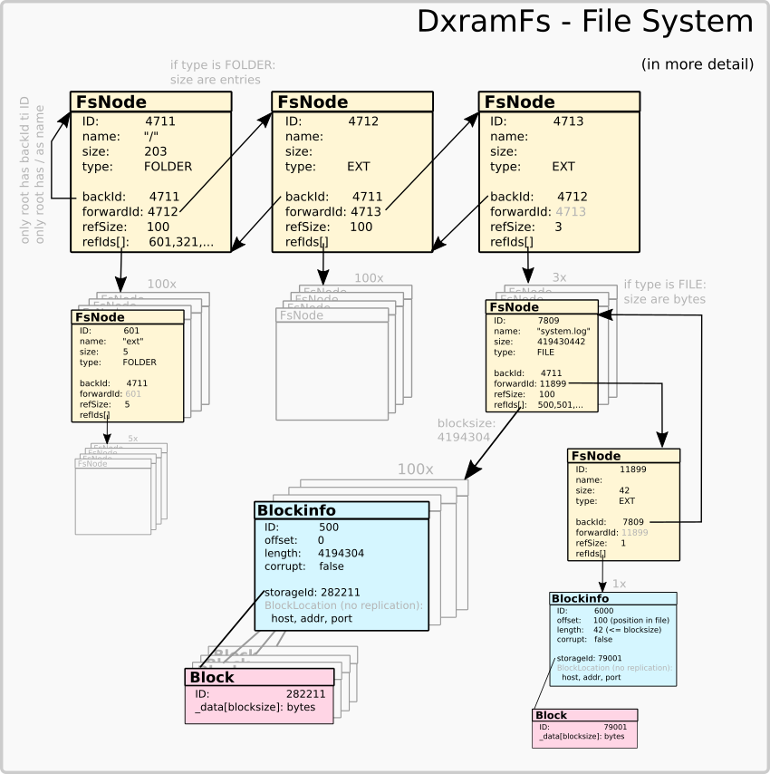
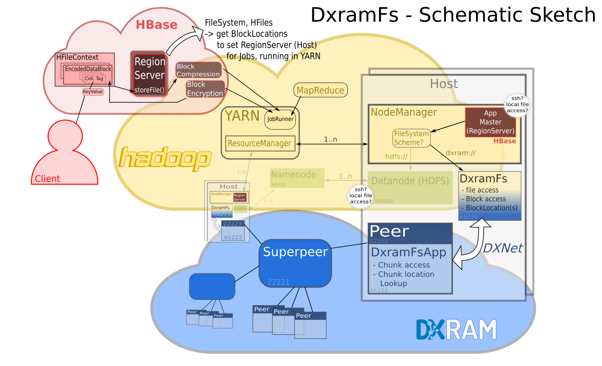
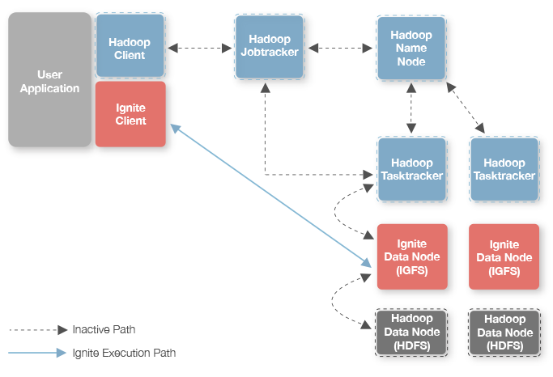

# Machbarkeit von Hbase auf DXRAM

Ziel dieser Projektarbeit war es, heraus zu finden, ob sich die NO-SQL Datenbank Hbase
mit dem verteilten Key-Value-Store DXRAM verbinden lässt. Hbase nutzt Hadoop und dessen
Dateisystem HDFS zur Speicherung, welches durch DXRAM abgelöst werden sollte. Ferner gab es als Ziel
eine konkrete DXRAM-Anwendung zu entwickeln, die sich problemlos in populäre verteilte Entwicklungen
auf Basis von Hbase oder Hadoop einbinden lässt. Dies sollte Performance-Vorteile durch
DXRAM verdeutlichen, welche durch Verwendung von Infiband und einer Speicherung
im Arbeitsspeicher (an der Java Heap-Verwaltung vorbei) zu erwarten sind.
Die Popularität von DXRAM sollte damit gefördert werden. Zur Umsetzung wurden drei
mögliche Konzepte ins Auge gefasst: 1) Nachbau von Hbase mit DXRAM auf der Basis
der Thrift Schnittstelle, die Hbase einem Client zur Verfügung stellt. 2) Mit libfuse
DXRAM unter Linux mount-fähig machen, und Hbase mit Hadoop im lokalen Dateisystem
laufen lassen. 3) Das ,,Scheme'' Konzept von Hadoop beim Dateizugriff nutzen,
um bei Zugriffen auf `dxram://` anstelle von `hdfs://` eine Hadoop-Kompatible
Dateisystem-Implementierung anbieten zu können. Wir entschieden uns in der Projektgruppe für
das dritte Konzept, da es weder den Nachbau von Hbase, noch Performance-Verluste
durch libfuse zur Folge hatte. Nähere Details zur Software, Entscheidungsfindung, Konzept zur Umsetzung
mit Details zu besonderen Herausforderungen sind in den kommenden Kapiteln beschrieben.
Im letzten Kapitel findet man einen Vergleich zu anderen Projekten, den aktuellen Stand
dieses Projekts sowie Überlegungen zur zukünftigen Weiterentwicklung.

# Beteiligte Software

In diesem Kapitel gehe ich grob auf die genutzte Software ein, ohne den kompletten
Funktionsumfang zu beschreiben. Die kommenden Unterkapitel beschreiben
auch Probleme, die ich bei der Nutzung oder Dokumentation dieser Software hatte.
Bei wichtigen Komponenten, die für meine Projektarbeit interessant sind, gehe ich jedoch
auch ins Detail.

## DXRAM

DXRAM wird an der Heinrich-Heine Universität in Düsseldorf entwickelt und lebt von den
Studenten, die diese Software unter anderem durch Projekt-, Bachelor- und Masterarbeiten
befruchten. DXRAM ist sowohl in C als auch in Java (8) geschrieben, wobei Beispiel Anwendungen
und Benchmarks in Java geschrieben sind. DXRAM ist inzwischen nicht nur ein verteilter
Key-Value-Store, sondern umfasst ein ganzes ,,Ökosystem'' von Modulen, mit bzw. in welches
man seine verteilte Anwendung einfügen muss. Als Keys verwendet DXRAM
Chunk-IDs, die auf ,,Chunks'' -- den allokierten Speicher -- zeigen. Mehrere Peers,
die durch Superpeers verwaltet werden, sind als Speicher- und Anwendungsknoten vernetzt.
DXRAM übernimmt das Anlegen, Übertragen und ggf. Sperren von Chunks, wobei es bei Anwendungen weder
eine Lastverteilung übernimmt, noch eine Entscheidung trifft, auf welchem Peer der
Chunk angelegt wird. DXRAM stellt entsprechende Services in einer Anwendung zur Verfügung,
um solche Entscheidungen dem Entwickler zu überlassen.

Bedauerlicherweise ist die Dokumentation auf viele Teilprojekte verteilt und es werden deployment Skripte
empfohlen (github), die jedoch in ihrem Umfang den Start in die Entwicklung eher erschweren. Sollte
man bereits einen Cluster passend konfiguriert zur Hand haben, mögen diese Skript nötig sein.
Ich hingegen entwickel vorrangig erst mal lokal, kompiliere einmal dxram, kompiliere eine
dxapp (siehe github), kopiere diese dxapp in den passenden build-Ordner von DXRAM, trage die
App in der Config von DXRAM einmalig ein, starte zookeeper, starte DXRAM als Superpeer, starte
(mehrfach) DXRAM als Peer und bin dann fertig. Dies sind (auf lange Sicht) weniger als 6
Kommandozeilenbefehle und erfordert für einen ersten Start in DXRAM kein komplettes Deployment-System.

Wie auch in anderen Software-Projekten gibt es DXRAM zwei Arten von Beispielen: 

-   Hallo World (ohne z.B. die wichtige Funktion der Chunk-Speicherung zu zeigen)
-   Ein Beispiel, was den kompletten Funktionsumfang abdeckt und für den Anfang zu komplex ist
-   Anwendung XY (inzwischen veraltet)

Leider hatte ich mich am letzten Punkt orientiert, was in diesem Fall speziell DxGraph in einem
alten Repository war. Dort gab es Chunks, die meiner Vorstellung der Speicherung von
Objekten, die nur aus Attributen von unterschiedlichen Datentypen bestanden, am nächsten kamen.
Darunter waren diverse Methoden, um Strings und Arrays in Chunks ab zu legen. Diese
Methoden existieren auch weiterhin in DXRAM. Sie verleiten jedoch dazu, sich über die
initiale Chunk-Größe im Speicher keine Gedanken zu machen und beim Ändern der Daten
oder der Initialisierung den Aspekt der tatsächlichen Größe zu vergessen. Dies hat mir
zum Ende der Projektarbeit die meiste Zeit gekostet, da Strings und Arrays in der Größe
variierten, was bei der (De-)Serialisierung nach der Übertragung bei einem 2. Peer
nicht abgefangen wurde.

## DXNET

DXNET stellt in DXRAM die Übertragungsschicht dar. Es arbeitet unabhängig von DXRAM und
kann in normalen Java-Anwendungen genutzt werden. DXNET ist von mir in Hadoop genutzt worden,
um zwischen Hadoop und einer DXRAM Anwendung Daten austauschen zu können. Der Punkt der
(De-)Serialisierung findet sich hier wieder: Während in DXRAM Chunks übertragen und
(de-)serialisiert werden müssen, sind es in DXNET Messages. Da eine Message eher ein
kurzweiliges Objekt ist, fielen die unterschiedlichen Längen bei Arrays mir nicht
auf. Allerdings hatte ich dort ebenfalls Probleme bei DXNET (oder DXUTILS?) Methoden,
die Strings betreffen. So habe ich hier byte-Arrays mit fester Größe gefüllt, anstatt
die fertigen Methoden von `dxutils` zu nehmen.

Zudem fehlte mir in DXNET ebenfalls ein griffiges Beispiel, um zwei Aspekte richtig
zu verstehen:

-   synchrone Datenübertragung
-   Response Message

Dies führte in meinem Code zu einem sehr unschönen System, wenn ich z.B.
zu einer ChunkId in Hadoop via DXNET nach einem Datei-Block frage: Nach dem Senden
einer `AskBlockMessage` wartet in einer Schleife mein Code darauf, dass der
Message-Handler der `GetBlockMessage` ein statisches Objekt in der `AskBlockMessage`
auf ,,nicht NULL'' setzt. Dieser unfeine Code sollte einer weniger pragmatischen
Lösung zum Austausch von Daten zwischen Hadoop und DXRAM weichen.

## HDFS, Hadoop und Hbase

hbase-1.4.0

hadoop-2.8.2

Die Software HDFS, Hadoop und Hbase ist jeweils in Java geschrieben und ihr
Code ist Online verfügbar. Bei HDFS (Hadoop Distributed File System) handelt
es sich um ein Dateisystem, welches Dateien in große Blöcke von einigen Megabyte
aufteilt. Gegenüber normalen Dateisystem ist es für große Dateien ausgelegt und
speichert zusätzliche Informationen zu jedem Block ab, wie Replikationsnummer,
Netzwerk-Infrastruktur Daten, Speichermedium und Ort/Host. Rund um dieses Dateisystem
hat sich das Hadoop ,,Ökosystem'' gebildet, welches z.B. MapReduce in einer
verteilten Form anbietet und die CPU Ressourcen eines DataNodes, welcher einen
Block trägt, nutzt. Die Begrifflichkeiten der Komponenten und deren Zusammenspiel
haben sich in Hadoop über die Jahre immer wieder etwas geändert. Das Grundprinzip
ist jedoch gleich geblieben: Verarbeite einen Block dort, wo er liegt, denn eine
Prozessmigration ist schneller, als eine Datenübertragung eines ganzen Blocks.
Hadoop hat sich vom simplen MapReduce hin zu einem komplexen RessourceManager
entwickelt (YARN), der Entwicklern eine verteilte Job/Batch Verarbeitung ermöglicht, welche
nicht nur auf MapReduce beschränkt ist. Alle Beschreibungen zu dem Thema
sind allerdings auf HDFS Komponenten (NameNode, DataNode) ausgelegt, obwohl jeder
Verarbeitungsknoten mit einem NodeManager nicht zwingend auf HDFS als Speicherresource
ausgelegt ist. Mit [Ignite](https://apacheignite-fs.readme.io/docs/map-reduce)
und [Alloxio](http://www.alluxio.org/overview/architecture) fand ich bisher nur zwei Projekte, die ein Dateisystem im RAM
für Hadoop zur Verfügung stellen. Während das Erste mit eigenen (inzwischen in Hadoop
veralteten) MapReduce Komponenten an HDFS ,,vorbei arbeitet'' so kopiert
Alloxio das Hadoop Ökosystem im Grunde komplett, und stellt seine eigenen Komponenten
zur Ressourcenverteilung zur Verfügung. Alloxio mountet fremde Dateisysteme
in sich hinein, anstatt wie im ursprünglichen Hadoop Ökosystem diese nur parallel (mit unterschiedlichem ,,Scheme'')
anbieten zu können. Gleich, ob ein Projekt nahe des Hadoop Ökosystems
ein eigenes System zur Prozessverarbeitung anbietet oder nicht, das Dateisystem,
welches die Daten trägt, muss der Prozessverwaltung Informationen liefern, die
die Wahl des ausführenden Knotens ermöglicht. Da wir als Anwendung Hbase nutzen wollen,
war ein Blick in Quellcode von Hbase nötig, um eine Entscheidung zu treffen, was
für Informationen hinterlegt sein müssen.

*Scheme*: In Hadoop wird zur Pfadangabe ein Scheme vorangestelle, welches das
betroffene Dateisystem -- also eine passende Implemenierung davon in Hadoop -- sowie
einen möglichen *Namenode* (Infos über Blocklocation zu einer Datei) beinhaltet.

Hbase ist die Opensource-Version von Google BigTable. Es ist eine No-SQL Datenbank,
bei der das schnelle Speichern von kleinen Änderungen eines Datensatzes im Vordergrund
steht. Das Konzept ist vergleichbar mit einem Logging von Änderungen mit einem
Zeitstempel, die später bei einem Snapshot zusammengeführt werden. Bei Anfragen 
an diese Datenbank wird das schnelle Ausliefern eines Datensatzes bevorzugt,
der nicht zwingend die neusten Änderungen enthält. Sehr alte Informationen werden
nicht gelöscht, sondern komprimiert abgespeichert und bei Bedarf wieder
entpackt.

Obwohl das Abspeichern vieler kleiner Änderungen und das Ausliefern von evtl.
alten Daten eher einem verteilten Key-Value Store entspricht, setzt Hbase auf Hadoop
und HDFS als verteilten Massenspeicher. HDFS, welches für große Dateien ausgelegt
ist, bietet diverse Vorteile gegenüber einem reinen Key-Value Store:

-   Verteilte Prozessverarbeitung 
-   klassifizierung des Speichermediums (RAM, SSD, HD)
-   ein umfangreiches Framework zur verteilten Auswertung der gespeicherten Daten

Eine weitere Stärke von HDFS ist die `append()` Operation bei Dateien, bei der nicht
die gesamte Datei, sondern nur der letzte Block geladen werden muss.

Die verteilte Prozessverarbeitung ist für HBase in sofern nötig, da Jobs wie Kompression,
Entpacken und Snapshots regelmäßig neben der Anfragenbearbeitung und Speicherung anfallen.
Im Code von HBase finden sich für die Kompression und Dekompression auch die
Begriffe *crypt* und *encryption* sowie *EncodedDataBlock*.

Die Verteilung der Daten einer ,,Tabelle'' wird über deren Key-Einträge gesteuert. Die Knoten,
welche die Daten zu verarbeiten und verwalten haben, sind für einen Bereich an Keys der Tabelle
verantwortlich. In HBase 2.1 und Hadoop 2.7.2 wird dies als *RegionServer* bezeichnet, der
als Anwendung (*AppMaster*) auf einem *NodeManager* läuft. Im Reference Guide von HBase 2.1 
wird gesagt, es handle sich dabei um einen *Datanode* -- ein HDFS Knoten also. Das ist
aber so nicht ganz korrekt, da streng genommen Hbase das *Scheme* Konzept für unterschiedliche
Dateisysteme übernommen hat. Schaut man sich den Code in HBase genauer an, so
fällt die Wahl des RegionServers auf den *Host*, der zu den Angefragten Daten
die meisten Blöcke besitzt. Sollte das Dateisystem hier die Methode `getFileBlockLocations()` nicht
überschreiben, wird nur `localhost` und als HDFS Datatransfer-Port `50010` zurück gegeben.

Wie der genau Zugriff auf einzelne Blöcke in Hadoop und HBase abläuft, konnte ich bisher
noch nicht nachvollziehen. Ob ein Prozess initial auf einer Datei und somit auf einem
NodeManager mit den meisten Blöcken ausgeführt wird, und dann beim Laden der Blöcke
ein Prozess auf einem Block zu einem anderen NodeManager migriert wird, konnte ich nicht
herausfinden. Die default Portangabe `50010` für einen HDFS Datanode deutet darauf hin,
dass hier keine Logik greift, die Blöcke jedes Dateisystems an einen ausführenden Knoten
überträgt (AppMaster auf einem NodeManager) oder eine Prozessmigration stattfindet. Dieser
Port wird nur für Daten eines HDFS Datanodes gebraucht. Dies legt nahe, dass bei einer
Operation auf einer Datei in einem Nicht-HDFS Dateisystem auch spezielle Operation
bei diesem Dateisystem zur Verfügung gestellt werden müssen, um eine Operation auf
Blöcken nahe des Datenspeichers zu ermöglichen.

Dieser letzte Abschnitt legt nahe, dass man Hadoop und HBase mit anderen Dateisystemen
als verteilte Anwendung nutzen kann. Will man jedoch Prozesse auf einzelnen Blöcken
statt Dateien ermöglichen, kann man nicht mehr auf die Hadoop Routinen, welche auf
HDFS ausgelegt sind, zählen. Interessant ist die Tatsache, dass in der
Abstrakten Hadoop Klasse `FileSystem` keine `getBlock()` Methode existiert. Hadoop
arbeitet wohl primär mit `append()` auf dem letzten Dateiblock und erzeugt neue Dateien,
anstatt in bestehenden die Blöcke zu verändern. Diese Vermutung stützt sich auch
beim Einbau eines Loggings im Original HDFS Code, wo bei MapReduce Beispielen
zwischendurch Dateien angelegt, gelöscht und umbenannt wurden.

## Maven, Gradle, Versionierung und Codepflege

Das Hadoop Ökosystem mit HDFS (Version 2.8.2) lässt sich prima mit Maven kompilieren/bilden.
Dies galt auch für den [Google Cloud Storage Connector](https://github.com/GoogleCloudPlatform/bigdata-interop/tree/master/gcs),
an den ich mich ab 8. Februar 2018 orientierte. Davor hatte ich noch meine
Anpassungen in Hadoop via IDE gemacht und gebildet. Es war ein erheblicher Zeitaufwand,
alle Bibliotheken von DXNET und Hadoop in den passenden Versionen aufeinander
ab zu stimmen, so dass der von mir erstellte DXRAM Connector als jar-File inkl. weiterer
Bibliotheken in Hadoop problemlos läuft. Bei der Umstellung von Maven auf Gradle
im August 2018 bei allen DXRAM Projekten konnte ich dies nicht mehr adäquat
in den Connector einpflegen. Um in der IDE leichter arbeiten zu können und wegen
kleinerer Änderungen an DXNET habe ich dessen Code händisch in den Code des
Connectors eingepflegt. DXNET 0.5.0 ist also als Quellcode dort eingepflegt.

Der DXRAM Part meines Projekts ist problemlos auf gradle migriert worden. Dies gilt
auch für einen DXNET Client, mit dem ich zuletzt die Anfrage an die DXRAM Application
testen wollte, ohne den Connector/Hadoop gehen zu müssen.

Meine Erfahrungen mit Maven und Gradle waren oft frustrierend. Zwar hatte ich mir
Tutorials (speziell für Maven) angeschaut, aber das Erzeugen eines *.pom* Files,
welches Plugins wie Lombok unterstützt, die passenden Bibliotheken für Hadoop
herunter lädt, andere jar-Files für DXNET berücksichtigt, war am Ende eher
Trial-And-Error sowie Copy-Paste arbeit aus anderen Projekten oder Stackoverflow.
Das es bei den Plugins und Maven ebenfalls unterschiedliche Versionen gibt, dann
noch eine ,,best practice'' Empfehlung gibt oder Beispiele veraltet oder falsche
sind, kommt noch hinzu. Speziell an dieser Stelle konnte ich nachvollziehen,
warum ein Programmierer wochenlang damit beschäftigt, als Leiter eines neuen Softwareprojekts
keine Zeile Quellcode schreibt und sich nur damit auseinander setzt, dass
das Build-System korrekt läuft. Zwei größere Frameworks in einem Projekt
zusammen zu führen, ist nicht trivial.

## Zookeeper und Kerberos

Zur Zeit benötigt DXRAM (0.5.0) noch Zookeeper. Dies gilt auch für HBase, welches
zusätzlich Kerberos nutzt. Mit Kerberos und HBase hatte ich immer Probleme. Die Java Beispiel
für HBase als auch die HBase Console bekam ich teilweise nicht zum laufen, obwohl
ich nichts in Hadoop geändert oder eingebunden hatte. Im März 2018 habe ich mich
daher erst mal auf die Hadoop MapReduce Beispiele beschränkt, um weiter zu kommen.

# Entscheidungsfindung

Ein Blick auf den Quellcode von HBase zeigte, dass es für einen Client, welcher auf
HBase zugreifen will, für mehrere Programmiersprachen eine API gibt. Schaut man sich
diese jedoch genauer an, verbirgt sich dahinter [Apache Thrift](https://thrift.apache.org/). Meine Erfahrungen
mit Thrift in meiner Bachelorarbeit waren sehr positiv. Es ist vergleichbar mit [RPC](https://docs.oracle.com/cd/E19683-01/816-1435/index.html) von
Sun (bzw. ONC+ von Oracle) und erzeugt Code-Gerüste (Server wie Client) für unterschiedliche
Sprachen auf der Basis einer IDL. Diese [Thrift Datei](https://wiki.apache.org/hadoop/Hbase/ThriftApi), in der alle nötigen
Datenstrukturen und Calls beschrieben sind, ließe sich leicht verwenden, um
das gesammten Request-Handling von HBase durch eine eigene Implementierung
aus zu tauschen. Wenn man keinen Wert auf Snapshots und (De)Komprimierung legt,
ist dies auf den ersten Blick die beste Lösung, um HBase durch eine DXRAM Anwendung
aus zu tauschen. **Für die Zukunft wäre das ein interessantes Projekt**. Ein anderes
Projekt wäre, wenn man DXNET oder Infiniband auf der Basis des Template Konzepts
von Thrift in Apache Thrift zur Verfügung stellt. Zur Zeit meiner Bachelorarbeit
hatte ich nur Sockets und für Javascript-in-Browser-Clients Websockets in Thrift gesehen.

Eine tiefere Recherche zum Thema Hbase zeigte, dass dessen Anwendungen vorrangig
in Java geschrieben werden. Die HBase API bietet dort (ich kann das an dieser Stelle nicht
belegen) mehr Möglichkeiten. Da HBase auf Hadoop aufbaut, drängt sich das Hadoop
Ökosystem zur Verarbeitung von Daten in HBase als Framework auf. Da DXRAM
mit dieser Projektarbeit in einem populären Anwendungszweig eintauchen sollte,
wäre ein komplettes HBase- und Hadoop-Replacement weniger ratsam, als eine
Integration von DXRAM in Hadoop. Hadoop (und HBase) wirbt damit, dass es nicht
auf HDFS als Dateisystem angewiesen ist. In Hadoop findet sich unter anderem
eine FTP-Dateisystem Anbindung oder eine auf das lokale Dateisystem. Die Idee
war, hier nun ein DXRAMfs zu hinterlegen, welches anstelle von HDFS unser DXRAM
als Massenspeicher nutzt. DXRAM als Dateisystem in Hadoop zu implementieren,
würde allen Hadoop und HBase Anwendungen ohne Programmieraufwand DXRAM als
Massenspeicher zur Verfügung stellen.

Für die Idee *DXRAM als Dateisystem in Hadoop* gab es zwei Möglichkeiten, die
ich in Betracht zog:

1.  DXRAMfs mountfähig unter Linux mit [libfuse](https://github.com/libfuse/libfuse).
#.  DXRAMfs auf die selbe Art wie HDFS oder FTP als Dateisystem in Hadoop implementieren.

Die erste Möglichkeit baut auf der Idee auf, man könne doch in HBase und Hadoop
als Speicher die Angabe `file:///tmp/dxrammount/` machen. Auf diese Weise würde man
DXRAM auch noch einer Vielzahl anderer Systeme zur Verfügung stellen. Es wäre dann
vergleichbar mit NFS. Da NFS auf RPC aufbaut und nicht libfuse nutzt, könnte man
sich dies als zukünftiges weiteres Projekt vorstellen, bei dem man in den Code von NFS schaut.
Die Nutzung des `file://` Scheme in Hadoop lässt den Code von Hadoop unberührt
und man verliert die Möglichkeit, dem Hadoop Ökosystem Informationen zum Standort
der Daten zu geben. Die Idee, in einer Ordnerstruktur die Lokalisation der Daten
zu hinterlegen, wäre nicht so gut. Auf diese Art würde man das Prinzip aufgeben,
dass eine Anwendung beim Zugriff auf ein Verteiltes System dieses als ein ,,Ganzes'' sieht.
Die Verteilung der Daten wäre nicht mehr transparent/versteckt und die Anwendung
müsste sich beim Dateizugriff mit den Knoten und dem Speicherort auseinander setzen.^[Dies ist auch ein
Kritikpunkt von mir an DXRAM, da in der Version 0.5.0 der Peer als ID angegeben werden muss,
wo ein Chunk abgelegt werden soll. Das Handling, ob dieser Peer online ist und ob
dort überhaupt noch Speicher zur Verfügung steht, ist somit in die Verteilte Anwendung
übertragen worden und nicht transparent.] Zusätzlich riet man mir von
libfuse ab, da mir von Performance-Problemen berichtet wurde, die jeden Speedup
von DXRAM zu Nichte machen würde.

Die zweite Möglichkeit DXRAM als Dateizugriff in Hadoop ein zu bauen, ist eine Implementierung
vergleichbar mit anderen ,,Konnektoren'' wie FTP, viewfs, hdfs usw. Hierzu gibt es sowohl
Beispiele und einen [Contract](https://wiki.apache.org/hadoop/HCFS/Progress), der das verteilte Verhalten 
des neuen Dateisystems beschreibt, welches unter anderem nicht durch Unittests 
geprüft werden kann. An dieser Stelle muss einem klar werden, das Hadoop einem
nicht das Sperren auf Dateien abnimmt, sondern dass man dies selbst implementieren muss.
Würde das Interface von Hadoop einem dies automatisch abnehmen, müsste
in dem *Contract* kein Hinweis bzgl. atomarer Operationen stehen. Diese Form der
Einbindung von DXRAM in Hadoop kann genutzt werden, um weitere Information über
den Speicherort der Daten zu hinterlegen. Tatsächlich konnte ich in der ganzen Zeit
nur die Methode `getFileBlockLocations()` beim *RegionServer* von HBase finden,
wo es um die Wahl des Hosts geht, welcher zu den angefragten Dateien die meisten
Dateiblöcke beheimatet.

Zwischendurch kam auch die Idee, man könne doch von Ignite oder anderen Projekten, die
mit einem Key-Value Store eine Hadoop-Anbindung ermöglichen. Nach ca. 2-3 Tagen
musste ich diese Idee jedoch verwerfen. Ich hatte mich bereits in HBase, Hadoop, den
Google Cloud Storage Connector, sowie HDFS in den Quellcode eingelesen und fand
speziell in Ignite keinen Einstieg, wo sich der Key-Value Zugriff durch eine
Alternative auf Basis von DXRAM austauschen ließe.

Die Wahl, wie ich DXRAM als Massenspeicher in HBase Anwendungen zur Verfügung stelle,
fiel auf das Implementieren eines hadoop-kompatiblen Dateisystems, wie es z.B. beim
Hadoop eigenen FTP-Connector der Fall ist. Die Vorteile dieser Lösung gegenüber
den Anderen sind:

-   Gewinnung von Interesse an DXRAM in der HBase und Hadoop Community (weil kein Replacement)
-   keine Performance-Einbußen bei verteilter Ausführung durch den Verlust von Informationen
-   weiterhin Nutzung des Hadoop Ökosystems bei der Prozessverteilung
-   minimaler Aufwand bei HBase Anwendungen (Verwendung `dxram://` statt `hdfs://` in der Konfiguration)

# Konzept und Umsetzung

Die Grundidee war sehr einfach: Ich kopiere z.B. `fs/ftp/` Ordner mit dem FTP-Connector im Hadoop
Quellcode, nenne alles, was FTP heisst um auf DXRAM, entferne den FTP-spezifischen Code, und tausche
alles bei `connect()`, `disconnect()` sowie den grundlegenden Dateioperationen, wo `@Override` darüber stand,
durch meinen Code aus. Hinterher kompiliere ich Hadoop in der Console, und schon kann ich mit
folgenden Befehlen die Methoden testen:

    bin/hadoop fs -mkdir -p dxram://dummy:9999/test/abc
    bin/hadoop fs -put README.txt dxram://dummy:9999/
    bin/hadoop fs -ls dxram://dummy:9999/
    ... und andere Operationen.

Der Aufbau von diesem FTP Connector war recht simple und ich habe ihn übernommen, anstatt
mich am Code des *Google Cloud Storage Connectors* zu orientieren. So ist `DxramFs` bis heute
eine Erweiterung von `DelegateToFileSystem` und trägt in einer privaten Variable des Typs `DxramFileSystem`
ein Implementierung des Dateisystems (`extends FileSystem`). Was ich später
vom *Google Cloud Storage Connectors* übernommen habe war das Wissen, wie sich dieser
Code in Hadoop als jar-File einbinden lässt, ohne Hadoop (bzw. Teilprojekte davon) neu
builden zu müssen. Wichtig ist es, in der Hadoop Konfiguration `core-site.xml` diese Implementierungen
mit an zu geben:

~~~xml
    <property>
        <name>fs.dxram.impl</name>
        <value>de.hhu.bsinfo.dxramfs.connector.DxramFileSystem</value>
        <description>The FileSystem for dxram.</description>
    </property>
    <property>
        <name>fs.AbstractFileSystem.dxram.impl</name>
        <value>de.hhu.bsinfo.dxramfs.connector.DxramFs</value>
        <description>
            The AbstractFileSystem for dxram
        </description>
    </property>
~~~

Um von DXNET und DXRAM umgestört und losgelöst meinen Connector anfänglich testen zu können,
habe ich alles so implemetiert, dass Dateien im Ornder `/tmp/myfs/` abgelegt werden. Diesen
Connector nannte ich dann ,,Fake-Dateisystem''. Bei dessen Implementierung
wurde mir schnell klar, dass sich fast alle FileSystem Operationen auf eine Datei bezogen.
Außer private Methoden zur Pfad-Korrektur, Anfragen an ein Home- oder Working- Verzeichnis
oder connect/disconnect Methoden, habe ich alles in einer `DxramFile` Klasse implementiert.
Ein Blick in den Hadoop FS Compatibility Contract -- kurz [HCFS](https://wiki.apache.org/hadoop/HCFS/) -- scheint sowas
auch vor zu sehen. Ab Hadoop v2 solle man `FileContext` implemetieren statt FileSystem.
Da es in Hadoop eine gewisse Rückwärtskompatibilität gibt, habe ich das ignoriert.
Zumal Hadoop in ihrem eigenen FTP-Connector dies nicht mehr. Wie historisch dieser Code ist
merk man auch an diversen Deprecated Warnungen beim Ausführen und auch Kompilieren.
Allerdings wurde ich stutzig, als ich in Hbase eine Klasse `HFileContext` gefunden habe.
Diese hat jedoch nichts mit der `FileContext` Klasse von Hadoop zu tun.

Um ein Gefühl für die Verwendung der FileSystem Methoden bei Mapreduce oder kleinen Hbase
Beispielen zu bekommen, hatte ich in das Original HDFS zahlreiche Log Infos ausgegeben. Falls
sie sich die Suche des HDFS Connectors im Hadoop Code ersparen wollen, es ist
in `hadoop-hdfs-project/hadoop-hdfs-client/` und dort in `src/main/java/org/apache/hadoop/hdfs/`
und der Datei `DistributedFileSystem.java` zu finden.

Bis 9. März 2018 lief mein Fake-Dateisystem mit Mapreduce, jedoch bekam ich Hbase Beispiel
damit nicht zum laufen. Ich erhielt immer wieder die Meldung ...

    2018-03-05 16:56:09,817 ERROR [main] zookeeper.RecoverableZooKeeper: ZooKeeper exists 
      failed after 4 attempts
    2018-03-05 16:56:09,818 WARN  [main] zookeeper.ZKUtil: hconnection-0x37c366080x0, 
      quorum=localhost:2181, baseZNode=/hbase Unable to set watcher on znode (/hbase/hbaseid)
    org.apache.zookeeper.KeeperException$ConnectionLossException: KeeperErrorCode =
      ConnectionLoss for /hbase/hbaseid
      at org.apache.zookeeper.KeeperException.create(KeeperException.java:99)

... wenn ich die `hbase shell` aufrufen wollte. Das zookepper, was von DXRAM als zip mitgeliefert wurde, funktionierte aber.
Auch wenn dieser Fehler nicht darauf hindeutet, waren zwei dinge bis dahin noch offen:

-   das Fake-Dateisystem hatte bis dahin kein `append()` implementiert, welches Hbase braucht.
-   es ist unklar, ob das Fake-Dateisystem ähnlich wie bei Hadoop in der Config und als jar-File bei Hbase hinterlegt werden muss.

Ich machte an dem Tag einen Schnitt, und entschied für mich, dass Mapreduce ja besser sei als nichts,
auch wenn es mit Hbase nichts zu tun hat. Und so begann ich, die Operationen auf Dateien in `/tmp/myfs/` stückweise
mit DXNET an eine DXRAM Application weiter zu leiten, da sich DXRAM nicht direkt in Hadoop einbauen ließ. ^[Später betrachte
ich die Konzepte von Ignite und Alluxio, welche ein anderes, nicht RPC-ähnliches Konzept verfolgen, um einen
Zugriff auf ihr Dateisystem aus einer konkreten verteilten Anwendung heraus ermöglichen. Dies entfernt sich jedoch von
der Idee, dass nur mit einem File-System Connector in Hadoop und Infos zum Speicherort eine verteilte Prozessverwaltung
allein durch Hadoop ermöglicht wird.]

Im *HCFS* gab es noch einen weiteren Punkt, den ich leider bis heute nicht
klären konnte. Dort steht als Anforderung:

>   The filesystem looks like a "native" filesystem, and is accessed as a local FS...

Schaut man sich die Tutorials an, so wird viel mit ssh gearbeitet, was auf einen
gewissen lokalen Dateizugriff hindeuten kann. Schaut man in die Readme des *Google Cloud Storage Connectors*,
welcher auf den ersten Blick ein Mounten ins lokale Dateisystem nicht
aufführt, so ist diese Aussage im *HCFS* vermutlich historisch bedingt, als
YARN und ein NodeManager noch nicht existerten. In der Readme des *Google Cloud Storage Connectors*
heisst es als Feature:

>   **Quick startup**: In HDFS, a MapReduce job can't start until the NameNode is out of 
>   safe mode—a process that can take from a few seconds to many minutes depending on 
>   the size and state of your data. With Google Cloud Storage, you can start your job 
>   as soon as the task nodes start, leading to significant cost savings over time.

Ein NameNode, welcher den DataNode zu den angefragten HDFS-Daten kennt, ist also
auch hier nicht nötig und wie gesagt: ein Mounten ins lokale Dateisystem gibt es
bei diesem Connector nicht. Wie solle dies auch gehen? Die Knoten des Google Cloud
Storage sind auch weder mit ssh erreichbar, noch werden sie als Ausführende Knoten bei
Hadoop gelistet.

## Aufbau des DxramFs

Als Idee für den Aufbau des Dateisystems entschied ich mich für eine Mischung aus
Verkettung und Arrays. Ein `FsNode` ist zur Speicherung des Ordner oder Dateinamens
gedacht, sowie dieveres Größenangaben. Mit einem Array `refIDs` aus Referenznummer
wird auf weitere Ordner oder Dateien (ebenfalls `FsNode`) gezeigt. Ist der `FsNode`
eine Datei, so ist das Array mit Referenznummern auf `Blockinfo` gefüllt. Diese
Datenstruktur enthält dann in etwa die Informationen, welche in Hadoop beim
aufruf von `getFileBlocklocations()` gebraucht wird. Darunter ist auch eine
Referenznummer auf den `Block`, der den Teil der Daten einer Datei trägt. Sollte
das Dateisystem mit dem Array nicht mehr auskommen, so gibt es für `FsNode` noch
den Typ `EXT`. Die Referenznummer eines solchen `FsNode` wird dann in `forwardId` beim
vollen `FsNode` eingetragen. Die Größe dieses Arrays läßt sich einmalig in der
Config Datei von Hadoop hinterlegen bzw. der `DxramFs` Applikation in DXRAM.

## DXNET für RPC nutzen

Um Daten zwischen Hadoop und DXRAM 

namenode? Lockup

FTP... deprecated meldung

Contract:
- was ist mit "wie ein lokales Dateisystem" gemeint, und warum? ssh?

## 

# Vergleich und Ausblick

## Andere Projekte

google cloud storage, alluxio (Tachyon), ignite

Alluxio und Yarn ist etwas suspekt und der Master-Worker aufbau ist dem
ResourceManager-NodeManager aufbau sehr sehr ähnlich. Will man Alluxio in
Hadoop YARN benutzen, lässt man im Grunde Hadoop 2x laufen, wobei YARN
die Jobs verwaltet und ähnlich wie bei ignite die NodeManager und den RessourceManager
von Hadoop umgeht.

## Aktueller Stand

## Offene Punkte

-   Chunk Speicherung
-   UTF-8 Datei- bzw. Ordnernamen
-   bekannte Bugs bzgl. rm, mv
-   `create` und `DxramOutputStream`
-   `open` und `DxramInputStream`
-   `DxramFile.getFileBlockLocations()`
-   Tests mit mapreduce, multinode config, hbase
-   muss das Scheme auch HBase bekannt gemacht werden?
-   Den Typ `EXT` überall umsetzen (z.B. für mehr als 128 Dateiblöcke)
-   locks (dxram, hadoop, ...) wer übernimmt das, um inkonsistente Zustände aus zu schließen?
-   hadoop unit tests

# Anhang

zeiten + hinweise, wann ich was tat

Bis zum 19.10.2018 **426,75** Stunden.

## Notiz 2018-10-26

12:45 - 16:15   Erste Beschreibung zum Einbau des Dateisystems in Hadoop und Stolperstellen

## Notiz 2018-10-25

14:00 -         Korrektur und Update des *Sketches*
15:15 - 18:00   doku entscheidungsfindung fertig

## Notiz 2018-10-24

14:30 - 16:00 doku maven, gradle, zookeeper und kerberos

## Notiz 2018-10-23

13:30 - 16:15 doku hdfs, hadoop, anfang hbase
17:00 - 19:30 hbase abschnitt auch fertig

## Notiz 2018-10-22

13:15 - 16:00

Test und code-Umbau, so dass zumindest create() eines FsNode auf EINEM peer korrekt klappt.

-   später: blockinfo und block anlegen implementieren, falls noch zeit ist
-   diese Woche: Bericht über Projekt machen: Ideen, Changen, Stolpersteine

Zustand des Code ist jetzt ungefähr da, wo ich angefangen habe einen 2. Peer hinzu zu nehmen.

-   Verwendung mit nur EINEM Peer bei nicht-Datei Operationen ist ok. Aber: *Not supporting remove operation if chunk locks are disabled*
-   problem bei RENAME, da es 2 ordner mit neuem (gleichem) Namen erzeugt!

15:00 - 16:00   Finale Notizen in GITHUB und Abbruch des Programmier-Parts

16:45 - 20:30 Anfertigen Bericht über Projekt!