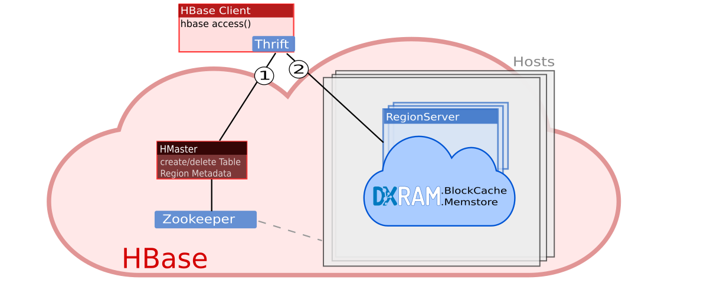
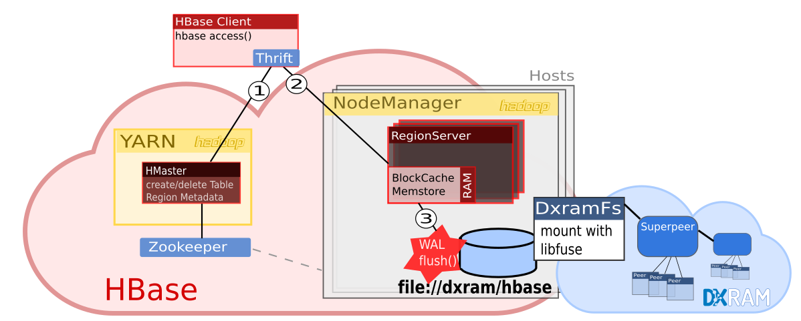
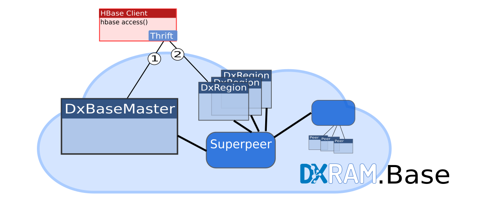
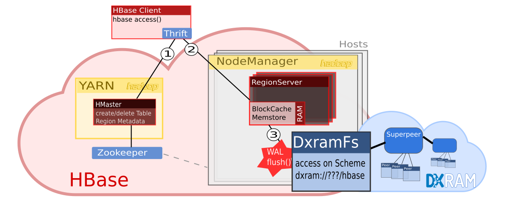

# Motivation

## Motivation

## DXRAM benutzen

- Einbindung in andere Software ausprobieren
- zeigen, dass es echte Alternative sein kann
- Popularität erhöhen

## DXRAM benutzen

Idee: Einbindung in populäre verteilte Projekte

- Hadoop
- HBase

(HBase nutzt Hadoop)

## Exkurs Hadoop

**Hadoop**

## Exkurs Hadoop

- begann mit HDFS 
- optimal für große Dateien, gesplittet in große Blöcke
- Blöcke verteilt über Datanodes
- Replikate und Infrastruktur Infos (Namenode)
- Prozessverwaltung (YARN) optimiert auf Blockverteilung

## Exkurs Hadoop - Grafik

## Exkurs HBase

**Hbase**

## Exkurs HBase

- noSQL mit BASE statt ACID (SQL)
- RAM und WAL je Node
- HDFS zur Persistenz
- Balance und Config wichtig (read, write, RAM, flush, Kompression)
- RegionServer: App in Hadoop

## Exkurs HBase - Grafik

## HBase und DXRAM

**HBase und DXRAM ?**

## HBase und DXRAM

- HBase nutzt MemStore & BlockCache (RAM)
- WAL: ACK erst, nachdem in HDFS geschrieben
- viel Aufwand für Persistenz und Compaction
- NoSQL: warten auf Festplatte bedeutet Tod für Anwendung

Warum nicht gleich DXRAM als verteilten Speicher nutzen?

# Wie machen es Andere?

## Wie machen es Andere?

Verteilter Speicher und Hadoop + HBase:

**Wie machen es andere Projekte?**

## Wie machen es Andere?

Ignite:

- verteilter Speicher (key-value)
- hat SQL Erweiterung
- eher Konkurrenz zu HBase
- Hadoop FS Connector
- WAL: HDFS zur Persistenz (SQL) optional

## Ignite - Grafik

## Wie machen es Andere?

Alluxio:

- Hadoop ,,Branch''
- statt Scheme: mounten anderer FS in Alluxio
- wie ein verteilter FS Cache
- Hadoop FS Connector
- etwas Schräg: HBase nutzen bedeutet quasi 2 Hadoops
- Under Storage: lokale Hard Disk
- Persistenz optional im FS

## Alluxio - Grafik

# Lösungswege

## Lösungswege

**Lösungswege DXRAM in Hadoop und HBase zu nutzen**

## Idee 1

Wie Ignite oder Alluxio eine Prozessverarbeitung vorbei an Hadoop
konstruieren. Konkret: RegionServer ist eine DXRAM App.

## Idee 1: DXRAM RegionServer

**Pro**

- Lösung auf HBase zugeschnitten
- weniger Konflikte als bei einem HBase Replacement zu erwarten
- kein Dateisystem, was zu implementieren wäre
- evtl. nur eine minimale Anpassung nötig

## Idee 1: DXRAM RegionServer

**Contra**

- tiefes Verständnis von HBase Quellcode nötig
- HBase Updates muss man evtl. aufwändig einpflegen
- kein Vorteil für andere Hadoop Projekte
- unklar, ob RegionServer ganz von Hadoop trennbar ist

## Idee 2

DXRAM zu einem mountfähigen Medium machen mit `libfuse`.

## Idee 2: mount DxramFs

**Pro**

- Anwender muss nicht umprogrammieren 
- nicht nur Hadoop könnte das nutzen

## Idee 2: mount DxramFs

**Contra**

- Verteilung der Daten unklar
- Hadoop weiss echten Speicherort nicht mehr
- Performance Probleme bei libfuse
- auch hier muss ein verteiltes Dateisystem programmiert werden

## Idee 3

HBase Replacement auf der Basis der Thrift Schnittstelle für einen Client.

## Idee 3: DXRAM.Base

**Pro**

- kein Umweg über Implementierung eines Dateisystem oder Hadoop
- vermutlich die effizienteste Art
- Prozesssplittung von Hadoop losgelöst

## Idee 3: DXRAM.Base

**Contra**

- unklar, wie HBase und Hadoop Community darauf reagiert
- vermutlich wird man auf Hadoop nicht verzichten wollen

Ist es einfacher HDFS oder HBase nach zuprogrammieren?

## Idee 4

DXRAM auch als verteiltes Dateisystem anbieten und
Connector für Hadoop machen.

## Idee 4: DxramFs Connector

**Pro**

- Anwender muss auf HBase und Hadoop Seite nichts umprogrammieren
- alle Hadoop Anwendungen können es nutzen
- Host basierte Prozesssplittung durch Hadoop ist möglich

## Idee 4: DxramFs Connector

**Contra**

Mal eben HDFS nach programmieren :o/

## Wahl

Die Wahl fiel auf die Lösung, wo HBase und Hadoop unberührt bleiben, und
NUR eine HDFS kompatibler Connector beigefügt wird (Idee 4).

# Umsetzung

## Umsetzung

- DxramFs App: stellt Chunks als Blöcke in einem FS dar
- DXNET: für RPC und Datentransport
- DxramFs Connector in Hadoop: nutzt DXNET
- DXRAM bleibt losgelößt von Hadoop

## Umsetzung - Grafik

## Umsetzung :-(

Projekt scheiterte primär an Debugging der Serialisierung reiner Attribut-Klassen. 

## Umsetzung: Fail 1

## Umsetzung: Serialisierung

- Initialisierung, ändernde Größen bei Updates
- gut wäre IDL wie bei Apache Thrift

## Umsetzung: Wunsch

## Umsetzung: Fail 2

Fehler Nr. 2: Aufschieben von Multipeer-Umgebung

## Umsetzung: Multipeer

Anstatt Multipeer und DXRAM Entwicklung
auf zu schieben, wäre z.B. als erster Ansatz ein **Multi-FTP Connector** (aus dem bestehenden)
gut gewesen. So hätte man Fragen des Prozesshandlings von HBase auf
Basis von Hostnamen bereits ausprobieren können.

## Umsetzung: DXNET Transport

Unelegant: DXNET eigentlich nur zum Transfer auf dem selben Host genutzt,
um zwischen Hadoop und DXRAM Infos austauschen zu lassen.

## Umsetzung: Aktuell

**Fertig:** FS Aufbau, Ordner Operationen

## Umsetzung: Aktuell

**Offen**

- Fehler bei Chunk-Speicherung klären
- Begonnen: create, open, flush, In- und OutStream 
- kleiner Bugs (siehe Webseite)
- Handling von Mehrfachanfragen
- Chunk sperren, Hadoop Unittests
- Tests mit MapReduce, Hadoop Multinode, HBase
- Performance Tests

# Fazit

## Fazit

- YARN zu stark an HDFS und Blockverteilung gekoppelt! 
- Ignite & Alluxio: YARN Replacement
- Key-Value Store: HDFS nachbauen schwerer, als Datenbank nachbauen?

## Fazit

- YARN zu stark an HDFS und Blockverteilung gekoppelt! 
- Ignite & Alluxio: YARN Replacement
- Key-Value Store: HDFS nachbauen schwerer, als Datenbank nachbauen?

Vermutlich Ja. **-> Apache Thrift**

## Fazit

Aber: Jeder wirbt auch mit *EINBINDUNG* in Hadoop, nicht mit *ERSATZ*. 

To Do: Anwendungsfälle finden, wo auf Hadoop & HBase Replacement sinnvoll ist.

## Fragen

Fragen?

## Fragen

Danke :o)

## Quellen

Im Grunde ist alles auf [no-go.github.io/HadoopDxramFS](https://no-go.github.io/HadoopDxramFS).
