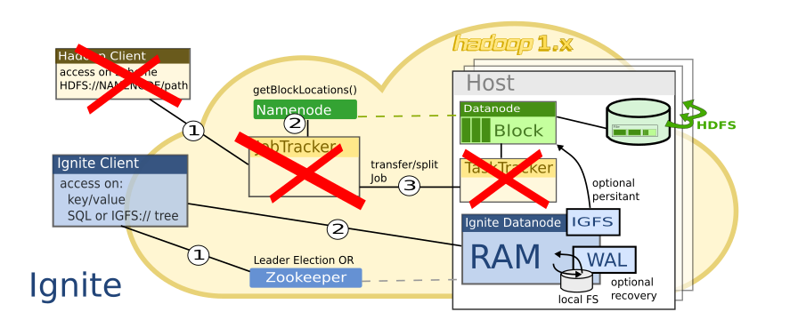
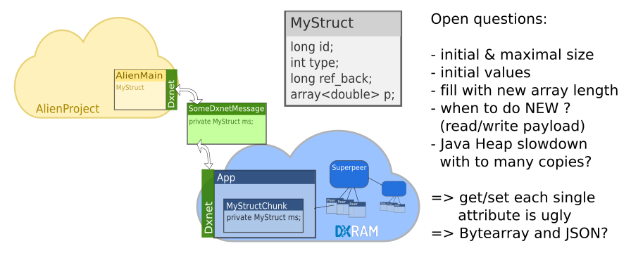

# Motivation

## To Get or To Become a Part of the Hadoop Tart

## DXRAM usage

- join to other popular Distrubuted Systems
- DXRAM as alternative storage system
- enlarge DXRAM popularity

## DXRAM usage

Idea: become a part of a popular project

- Hadoop
- HBase

Big Vision: remove HDFS access in HBase by DXRAM

## Excursion Hadoop

**Hadoop**

## Excursion Hadoop

- starts with HDFS: split big files into big blocks
- a block maybe replicated
- Namenode: stores Blocklocations and infrastructure info
- MapReduce: split *Job* into *Tasks* on blocks
- becomes more and more a process handling "ecosystem" (YARN)

Run Task where data block is stored. 

## Excursion Hadoop - Sketch

## Excursion HBase

**Hbase**

## Excursion HBase

- noSQL with BASE and not ACID (SQL)
- store in RAM, but a WAL for persistance 
- HDFS for WAL and flushes
- hard to balance (optimal for read OR write)
- each node has some RegionServer (handle key region for each column family)

## Exkurs HBase - Sketch

## HBase and DXRAM

**HBase and DXRAM ?**

## HBase and DXRAM

- HBase uses MemStore & BlockCache (RAM)
- WAL: does an ACK after writing change to HDFS 
- big focus on persistence and data compaction
- NoSQL: waiting for hard disk on writing? any benefit to normal SQL?

Why not using DXRAM as distributed RAM instead of harddisk, WAL and compaction processes?

# Other Hadoop friendly RAM stores

## Other Hadoop friendly RAM stores

Distributed Memory and Hadoop + HBase:

**How does other projects handle this?**

## Other Hadoop friendly RAM stores

Ignite:

- distributed key-value storage
- has an optional SQL engine
- sees itself as a competition to HBase
- optional WAL for recovery: local FS
- has a Hadoop FS Connector `igfs://`
- optional `igfs` persistence: `hdfs://`

## Ignite - Grafik

## Other Hadoop friendly RAM stores

Alluxio:

 -  Code looks like a Hadoop ,,Branch''
 -  instead of Hadoop Scheme: mount into `alluxio://tree`
 -  can work as a distributed FS cache
 -  persistence is an optional FS feature
     -  Under Storage: local FS
 -  has a Hadoop FS Connector
 -  FS Connector usable in HBase, too

## Alluxio - Grafik

# Approaches

## Approaches

**Solutions to use DXRAM in Hadoop and HBase**

## I: DXRAM.Base

HBase Replacement based on the Thrift IDL for HBase Clients

## I: DXRAM.Base

**Pro**

- maximal freedom to implement this
- maybe the most efficient way
- Hadoop independent

## I: DXRAM.Base

**Contra**

- unclear how HBase and the Hadoop community react to it
- the community may not want renounce Hadoop
- other Hadoop projects have low benefit from it

## II: RegionServer Mod

RegionServer RAM access modified with DXRAM stuff.

## II: RegionServer Mod

**Pro**

- optimized for HBase
- Hadoop independent
- maybe better compatibility than a complete HBase replacement

## II: RegionServer Mod

**Contra**

- deep know-how about code and HBase procedures necessary
- HBase Updates got in trouble
- other Hadoop projects have low benefit from it

## III: Mounting DXRAM

Mount DXRAM as RAM-Drive with `libfuse`

## III: Mounting DXRAM

**Pro**

- No HBase or Hadoop code have to been changed or added
- effect on all projects, using local FS for persistance and recovery

## III: Mounting DXRAM

**Contra**

- Hadoop loses information about block locations. Host based Task splitting inpossible
- Performance leaks with `libfuse`
- a bit complicated: build a NFS like filesystem with distributed block location

## IV: DXRAM FS Connector

Like Ignite and Alluxio: build a DXRAM FS Connector.

## IV: DXRAM FS Connector

**Pro**

- Modular addable to HBase and Hadoop
- benefit for all Hadoop projects without modifications
- Hadoops Host based Task splitting is possible

## IV: DXRAM FS Connector

**Contra**

Big Milestones:

- build a FS based on DXRAM
- make FS similar to the block based HDFS
- transport data from DXRAM Application to an alien like Hadoop

## Election

The choice fell on the DXRAM FS Connector, because it offers the widest range of uses.

# Implementation

## Implementation

- DxramFs App: Chunks are similar to blocks
- DXNET: RPC and data transport
- DxramFs Connector: Hadoop uses DXNET
- DXRAM not part of HBase or Hadoop

## Implementation - Sketch

## Implementation :-(

Project failed primarily because of debugging effort in serializing pure attribute classes. 

## Implementation: Fail 1

## Implementation: Fail 1

- inital values, different size with new data
- a IDL like Apache Thrift would be nice

## DXRAM feature request

## Implementation: Fail 2

The next mistake: slicing up the multipeer use-case

## Implementation: Fail 2

Single peer on localhost is a bad testing scene:

- Questions about an Alien Node to DXRAM Node mapping answered to late
- Hadoop Task splitting still not tested
- errors caused by wrong stored Chunks occours next to project end

Instead of building a local FS connector as a first test, I should have better
converted the Hadoop FTP connector to Multipeer szenario.

## Implementation: DXNET Transport

Is it optimal? Hadoop transfer jobs to local data, thus DXNET doing
network traffic just on localhost.

## Implementation: Now

**Finished:** FS structure, operations on directories

## Implementation: Now

**still open**

- bugs on storing and sharing chunks between peers
- starting with: `create`, `open`, `flush`, `In-` and `OutStream`
- small bugs in copy and rename (see website)
- big FS contents, really big file handling
- handling multiple DXNET RPCalls

## Implementation: Now

**far away**

- ATOMar FS access, Hadoop unit tests
- test with MapReduce and HBase code examples
- performance tests

# Conclusion

## Conclusion

- Ignite & Alluxio: Doing a YARN replacement
- Hadoop ecosystem is too close to HDFS block handling
- Is it easier to build a distributed noSQL Database than a distributed FS with an key-value store?!

## Conclusion

BUT: **nobody** advertises to **replace** HBase or Hadoop, but to be able to **cooperate** with them.

## Questions

Questions?

## Questions

Thank you for your attention.

## References

You got everything on [no-go.github.io/HadoopDxramFS](https://no-go.github.io/HadoopDxramFS).
